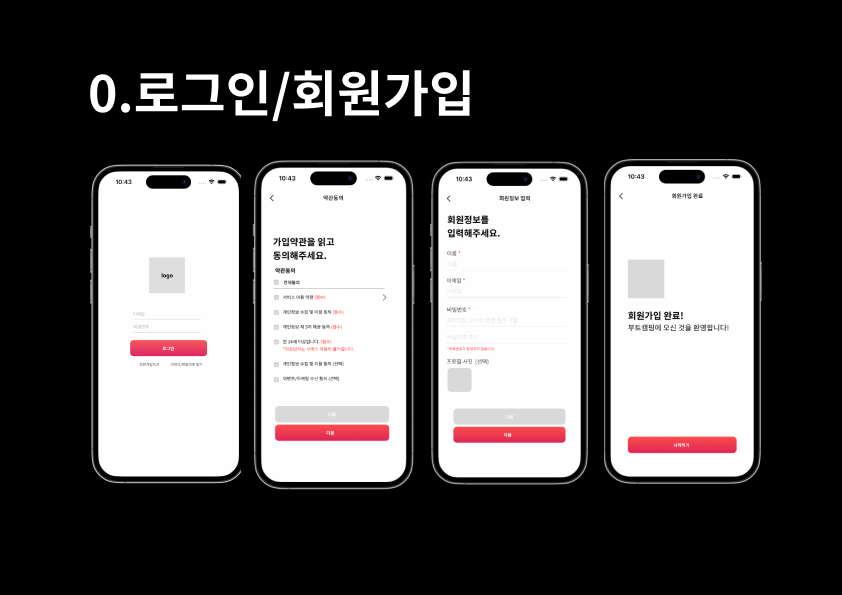

# 🔥 부트캠핑

캠핑 감성을 담다, 부트캠핑🔥 

### 앱 정의(ADS)

이 앱은 ‘갬성캠핑에 특화된’ 캠퍼들에게 사진 공유를 통한 캠핑 정보와 커뮤니티를 제공하는 앱입니다.

왜냐하면 인증샷을 자주 찍는 감성 컨셉의 캠퍼들에게 본인의 캠핑 사진을 직접 자랑할 수 있는 사진 공유 채널을 제공하고, 뷰가 우수한 캠핑장 정보를 공유할 수 있도록 하여 감성캠핑 라이프에 편리함을 더해주기 때문입니다.

---

## 앱 기능 설명
기획 이미지를 첨부합니다. 

0.로그인/회원가입 

1. 홈 - 메인
    1. 오늘의 캠핑 - 현재 핫한 캠퍼의 총 10개의 캠핑 피드를 보여줍니다. 
    2. 캠핑 피드 - 팔로우한 캠퍼들의 이야기를 담은 캠핑피드를 모아 볼 수 있어요. 
    
2. 플레이스 
    1. 갬성가득한 캠핑 플레이스를 보여줍니다. 큰 단위의 지역 (경기,인천 / 충청/ 경상,부산/ 전라,제주/ 강원)을 선택하면 해당 지역의 캠핑장을 보여줍니다.
    2. 상단 우측 북마크 버튼을 통해 북마크한 캠핑 플레이스를 확인할 수 있습니다.
    3. 세부 분류 기준 (캠핑, 차박, 카라반, 글램핑 등)을 통해 캠핑 플레이스 필터링이 가능합니다.
    4. 캠핑 플레이스를 선택하면 캠핑장에 대한 정보, 별점, 해시태그 등을 확인 할 수 있으며 우축 하단의 예약하기 버튼을 통해 예약 사이트로 이동할 수 있습니다. 
    
3. 캠핑 생활 (커뮤니티)
    1. 캠핑 생활 탭에서는 유저들끼리 소소한 캠핑 생활을 공유할 수 있습니다. 
    2. 캠핑 꿀팁, 질문, 중고거래, 글램핑, 동행 등 글 종류를 구분하여 해당 종류별 글을 볼 수 있습니다. 
    3. 캠핑 생활 → 글쓰기 버튼 (하단 가운데 글쓰기 탭 ) 을 통해 캠핑생활에 글쓰기를 할 수 있습니다.  (글쓰기 기능에 대한 설명은 5번에서 이어집니다)
    
4. 내 캠핑 (마이페이지)
    1. 나의 캠핑 이야기와 저장한 캠핑 피드를 확인할 수 있습니다. 
    2. 나의 캠핑 피드 이야기는 총 4가지의 형태로 이쁘게 볼 수 있습니다. 
    3. 캠핑 피드를 카드 형식으로도 확인 가능합니다.

1. 글쓰기 버튼 (가운데 탭 버튼)
    1. 홈, 플레이스, 내 캠핑 탭일때에 선택하면 캠핑 피드를 작성할 수 있습니다.
    2. 캠핑 생활 탭에서 글쓰기 탭 버튼을 선택할 경우에는 캠핑 생활을 작성할 수 있습니다. 
- **캠핑 피드 작성 시**
    - 사진은 10개까지 추가 가능합니다.
    - 부트캠핑 해시태그 : 감성 캠핑의 테마에 해당하는 해시태그를 적어주세요. 3개까지 입력 가능합니다. 해당 해시태그는 글의 제목이 됩니다.
    - 위치 등록 하기(선택) : 위치를 등록할 수 있습니다. 부트캠핑에 등록된 장소라면 게시글에 해당 캠핑장 정보로 이동할 수 있는 버튼이 생성됩니다.
    - 캠핑 이야기를 공유해주세요(선택) : 소제목은 게시글 카드에 보여지는 영역입니다. 자유롭게 소제목과 캠핑경험을 적으면 됩니당.
- 캠핑 생활 작성 시
    - 글 종류를 선택합니다.
    - 작성합니다.

# 활용한 기술

- FireBase를 활용한 데이터 구축과 서버 연동
- Auth: 로그인
- FireStore: 데이터 활용
- Storage: 사진 저장
- 고캠핑 API 사용해 JSON 파싱
- 데이터를 받아올때 비동기 페이지 로딩 구현
- MapKit을 활용해 실제 캠핑장 위치 맵뷰로 구현
- ObservableObject 활용해 커뮤니티 작성글 저장, 업데이트
- 다크모드 구현
